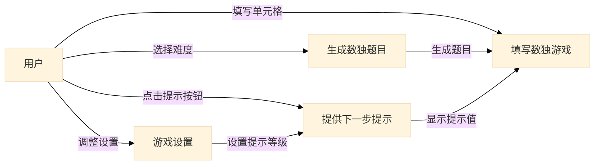
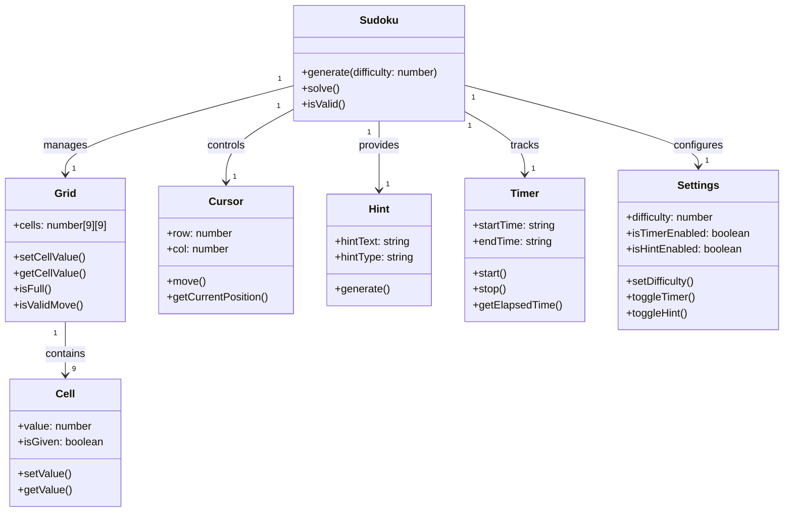
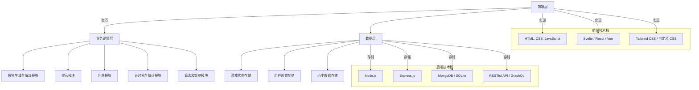
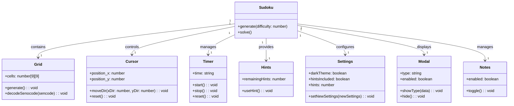

# 一、需求规格

## 1.1 项目愿景

项目的愿景分析如下：

#### 1. **核心目标**

数独乐乐项目的核心目标是开发一款既适合数独初学者又具备高效求解功能的数独应用。项目将通过提供友好的指引、智能提示和回溯功能，帮助用户更轻松地学习并享受数独游戏。同时，集成数独Wiki的题目和解法策略，为用户提供更多的挑战和学习资源。最终，目标是为用户提供一个具有高度可扩展性和持续更新能力的数独游戏平台。

#### 2. **用户体验**

- **初学者友好**：通过提供提示、推理方法和回溯功能，让用户更容易理解数独解题的思路，尤其是初学者。在解决数独的过程中，用户可以随时获得清晰的指引，了解每个步骤的推理依据。
- **智能提示**：集成提示按钮，当用户遇到困难时，点击提示可以获得下一步可行的答案，并且提示会解释推理方法和所使用的解题策略，增强学习效果。
- **回溯与探索**：提供回溯功能，允许用户探索不同的解题路径，帮助他们在多种可能的解法中进行选择。通过回溯，用户能够自由漫游数独解题空间，增进对数独解法的理解。

#### 3. **技术创新与集成**

- **SudokuWiki集成**：通过与数独Wiki（SudokuWiki.org）集成，数独乐乐能够直接导入Wiki中的题目和解法算法。用户不仅能够解决数独题目，还能够学习和验证算法策略，提升解题能力。
- **算法策略模块化**：数独乐乐将支持多种解题策略，如“Naked Single”、“Hidden Single”等，并保证新算法的引入不会破坏已有算法的正确性和性能。这将通过面向对象设计来实现，每个算法将独立封装，并通过策略模式来动态选择和扩展。

#### 4. **系统设计**

- **模块化设计**：采用面向对象分析与设计（OOAD）方法，将游戏的核心功能（如数独网格、提示、回溯、计时器等）分解为独立的模块，每个模块负责特定的任务。这样可以保持系统的高内聚性和低耦合性，方便功能的扩展和维护。
- **解法验证与性能优化**：引入的每个解题策略算法都将经过严格的验证，确保其正确性。同时，新的算法策略应当与现有策略模块独立，以保证老算法的性能不受影响，并且能够高效运行。

## 1.2 用例分析

数独乐乐的核心功能包括生成数独题目、自动解答、提供提示、回溯、导入自定义题目、查看解题策略等。部分用例阐释如下：

### 1. 用例名称：生成数独题目

- 目标：为用户生成不同难度的数独题目
- 基本流程：
  1. 用户选择难度（简单、中等、困难等）。
  2. 系统根据选择生成一个新的数独题目。
  3. 用户可以开始游戏。
- 扩展功能：
  1. 支持用户通过 SudokuWiki 中的题目 URL 导入。

### 2. 用例名称：填写数独游戏

- 目标：在提供的数独界面上完成题目的填写
- 基本流程：
  1. 用户选择一个单元格进行填写。
  2. 系统高亮显示相关行、列、区域的冲突单元格（如有）。
  3. 用户可以填写候选值或直接填写答案。
  4. 填写完成后，用户提交结果。
- 扩展功能：
  1. 提供Redo/Undo功能，用户可以撤销之前填写的内容，并取消之前的撤销步骤。
  2. 提供回溯功能，当用户在分支点进行探索出现错误答案时，可以回溯到当时的分支点。
  3. 采用多种策略进行提示的生成，用户点击提示单元格时可以看到当前单元格提示的依据。

### 3. 用例名称：游戏设置

- 目标：调整游戏相关设置
- 基本流程：
  1. 用户进入“设置”界面。
  2. 系统提供可选项：调整高亮设置、调节提示等级（一级、二级、三级）、启用/禁用候选值功能等。
  3. 用户保存设置并返回游戏界面。

### 4. 用例名称：提供下一步提示

- 目标：提供下一步提示，并说明提示依据的策略
- 基本流程：
  1. 用户点击提示按钮。
  2. 系统根据当前设置的提示等级，显示对应等级的候选值（一级：仅有一个候选值的格子；二级：有两个候选值的格子；三级：有三个候选值的格子）。
  3. 用户选择其中一个提示值。
  4. 弹出决策策略及决策依据。

用户与系统之间的主要交互流程，以及各个用例之间的关系如下：

- **用户**：与系统交互的主要角色。
- **生成数独题目**：用户选择难度后，系统生成数独题目。
- **填写数独游戏**：用户在数独界面上填写单元格，系统提供冲突检测和撤销/重做功能。
- **游戏设置**：用户调整游戏设置，包括提示等级和高亮设置等。
- **提供下一步提示**：根据用户设置的提示等级，系统提供对应等级的提示值，并显示决策策略和依据。

## 1.3 领域模型

领域模型描述了系统中的核心概念以及它们之间的关系。在数独乐乐项目中，核心概念主要涉及数独题目、网格、用户输入、解题策略、提示和计时等。以下是数独乐乐的领域模型分析。

#### 1. 核心对象

`Sudoku` 是核心对象，负责生成和解决数独谜题，依赖于 `Grid` 来管理网格的数据。`Cell` 表示网格中的每个单元格，`Cursor` 追踪用户的输入位置。`Hint` 提供解题帮助，`Timer` 记录游戏时间，而 `Settings` 管理游戏的设置选项。

| **核心对象**           | **职责**               | **属性**                                                     | **方法**                                                     |
| ---------------------- | ---------------------- | ------------------------------------------------------------ | ------------------------------------------------------------ |
| **Sudoku（数独谜题）** | 生成和解决数独谜题     | grid：9x9的数独网格；difficulty：难度等级                    | generate()：生成新的数独谜题；solve()：解答数独谜题；isValid()：检查网格有效性 |
| **Grid（数独网格）**   | 管理数独网格的状态     | cells：9x9网格的单元格状态                                   | setCellValue()：设置单元格的值；getCellValue()：获取单元格的值；isFull()：检查网格是否已填满；isValidMove()：检查数字是否有效 |
| **Cell（单元格）**     | 表示数独网格中的单元格 | value：单元格的值；isGiven：是否为给定数字                   | setValue()：设置单元格的值；getValue()：获取单元格的值       |
| **Cursor（光标）**     | 管理光标位置           | row：光标行位置；col：光标列位置                             | move()：移动光标；getCurrentPosition()：获取光标当前位置     |
| **Hint（提示）**       | 提供解题提示           | hintText：提示文本；hintType：提示类型                       | generate()：生成与当前状态相关的提示                         |
| **Timer（计时器）**    | 记录游戏时间           | startTime：开始时间；endTime：结束时间                       | start()：启动计时器；stop()：停止计时器；getElapsedTime()：获取经过时间 |
| **Settings（设置）**   | 管理游戏设置           | difficulty：游戏难度；isTimerEnabled：是否启用计时器；isHintEnabled：是否启用提示 | setDifficulty()：设置游戏难度；toggleTimer()：切换计时器；toggleHint()：切换提示功能 |

#### 2. 对象之间的关系

| **对象之间的关系**     | **描述**                                                     |
| ---------------------- | ------------------------------------------------------------ |
| **Sudoku与Grid**       | `Sudoku` 依赖于 `Grid` 管理数独网格的状态。`Sudoku` 使用 `Grid` 生成谜题、解答和校验。 |
| **Grid与Cell**         | `Grid` 包含多个 `Cell` 对象，每个 `Cell` 代表网格中的一个单元格。`Grid` 管理整个网格，`Cell` 管理单个位置的数据。 |
| **Cursor与Grid**       | `Cursor` 管理光标在 `Grid` 中的位置，帮助用户输入数据并更新 `Cell`。 |
| **Hint与Grid**         | `Hint` 根据 `Grid` 的状态为用户提供解题提示。                |
| **Timer与Sudoku**      | `Timer` 记录游戏的时间，计算从开始到结束的时间。             |
| **Settings与其他对象** | `Settings` 管理用户设置，影响 `Sudoku`、`Timer` 和 `Hint` 的行为。 |

## 二、软件设计规格

## 2.1 系统技术架构

#### 1. **整体架构**

数独乐乐的系统架构可以分为以下几个主要层次：

- **前端层**：负责用户界面的呈现与交互，提供给用户一个直观和友好的游戏体验。
- **业务逻辑层**：包含数独游戏的核心逻辑、解题算法、提示生成、回溯机制等。
- **数据层**：存储和管理游戏数据（如用户设置、游戏历史、题目和解法等），支持用户持久化游戏进度。

#### 2. **前端层**

前端层主要负责用户界面（UI）的实现，并与用户进行交互。基于前端框架（如 Svelte 或 React），前端层处理用户输入、呈现游戏状态、显示提示、回溯以及统计信息。

- **用户界面（UI）**：
  - **游戏网格**：显示9x9的数独网格，用户可以在其中输入数字。
  - **提示和回溯按钮**：提供提示功能，帮助用户在解题过程中获得线索，回溯功能帮助用户探索不同的解题路径。
  - **计时器**：显示游戏开始到当前的时间，帮助用户了解解答时间。
  - **设置面板**：用户可以自定义游戏难度、启用提示和计时器功能。
- **前端技术栈**：
  - **框架**：Svelte、React 或 Vue 用于实现响应式和动态的用户界面。
  - **样式**：Tailwind CSS 或自定义 CSS 用于构建直观且美观的界面。

#### 3. **业务逻辑层**

业务逻辑层是整个数独乐乐应用的核心，负责处理所有与游戏逻辑相关的操作。它包括数独题目的生成、解答、提示、回溯和算法的执行等。这个层次通过对象和模块进行组织，以便将不同的逻辑分离和高效管理。

- **数独生成与解决模块**：
  - 负责生成不同难度的数独谜题，并实现解题算法（如回溯法、策略模式）。
  - 生成谜题时会根据不同难度生成不同的初始数字，解答时根据当前的网格状态和规则求解。
- **提示模块**：
  - 提供用户提示，帮助用户在困惑时提供推理路径。
  - 提示功能可以依赖不同的解题策略，如“Naked Single”、“Hidden Single”等，向用户说明解答的依据。
- **回溯模块**：
  - 支持用户探索数独谜题的不同解法，通过回溯机制能够让用户“回到”上一步或选择不同的路径进行探索。
  - 支持撤销和重做功能，使得用户可以轻松管理操作历史。
- **计时器与统计模块**：
  - 记录用户解答数独题目的时间。
  - 统计用户的游戏成绩、解题速度、成功率等信息，提供游戏成绩的反馈。
- **算法和策略模块**：
  - 集成SudokuWiki的解题策略和算法，允许扩展和验证不同的数独解法。
  - 通过策略模式设计，算法模块能够灵活地切换和组合不同的解题策略，而不会影响系统的性能。

#### 4. **数据层**

数据层负责系统的持久化存储，保存用户的数据和游戏历史。它使得用户能够保存自己的游戏进度、查看历史记录和重新加载之前的题目。

- **游戏状态存储**：
  - 存储用户当前的游戏状态，包括已填充的数字、用户设置的难度、是否启用计时器和提示等。
  - 可以将用户的游戏数据存储到本地存储（localStorage）或后端数据库，以支持多平台的同步和恢复。
- **用户设置存储**：
  - 保存用户的偏好设置，如启用/禁用提示、计时器、难度选择等。
  - 设置可以在用户登录时同步，确保用户在不同设备间的统一体验。
- **历史数据存储**：
  - 记录用户的游戏历史和统计数据，包括解题时间、正确率等。
  - 用户可以查看自己历史的游戏成绩和解答过程。

#### 5. **技术栈**

- **前端技术**：HTML, CSS, JavaScript, Svelte (或 React/Vue)
- **后端技术**：Node.js (如果需要实现后端功能)，Express.js (API服务)
- **数据库**：MongoDB 或 SQLite（如果需要持久化用户数据）
- **API**：RESTful API 或 GraphQL（用于前后端数据交互）
- **算法实现**：JavaScript 编写的数独求解算法，可能涉及回溯法、策略模式等。

## 2.2 对象模型

对象模型是面向对象分析与设计中的核心部分，它描述了系统中各个类和对象之间的关系。在数独乐乐项目中，对象模型主要聚焦于数独游戏的核心对象，如数独谜题、网格、单元格、用户输入、提示、计时等，并定义了这些对象如何交互以实现游戏的功能。

以下是数独乐乐的对象模型分析：

#### 1. **核心对象**

| **对象**     | **职责**                                 | **主要属性**                                                 | **主要方法**                                                 |
| ------------ | ---------------------------------------- | ------------------------------------------------------------ | ------------------------------------------------------------ |
| **Sudoku**   | 负责生成和解决数独谜题                   | - grid: 9x9 数独网格                                         | - `generate()`: 生成新的数独谜题- `solve()`: 解答数独谜题- `isValid()`: 验证数独的合法性 |
| **Grid**     | 管理数独网格的状态                       | - cells: 存储9x9单元格的状态                                 | - `setCellValue()`: 设置单元格的值- `getCellValue()`: 获取单元格的值- `isFull()`: 检查网格是否填满 |
| **Cell**     | 表示数独网格中的单个单元格               | - value: 数字或空值                                          | - `setValue()`: 设置数字- `getValue()`: 获取数字             |
| **Cursor**   | 管理用户在数独网格中的光标位置           | - row: 光标所在行- col: 光标所在列                           | - `move()`: 移动光标位置- `getCurrentPosition()`: 获取当前光标位置 |
| **Hint**     | 为用户提供解题提示                       | - hintText: 提示文本- hintType: 提示类型                     | - `generate()`: 生成提示- `explain()`: 解释提示的推理方法    |
| **Timer**    | 记录并显示游戏时间                       | - startTime: 开始时间- endTime: 结束时间                     | - `start()`: 启动计时器- `stop()`: 停止计时器- `getElapsedTime()`: 获取已用时间 |
| **Settings** | 管理游戏设置，如难度、计时器、提示功能等 | - difficulty: 游戏难度- isTimerEnabled: 是否启用计时器- isHintEnabled: 是否启用提示 | - `setDifficulty()`: 设置游戏难度- `toggleTimer()`: 切换计时器功能- `toggleHint()`: 切换提示功能 |

#### 2. **对象之间的关系**

1. **Sudoku 与 Grid**
   - `Sudoku` 依赖于 `Grid` 来管理数独谜题的具体数据。`Sudoku` 负责生成谜题并调用 `Grid` 来存储和管理网格状态。
   - `Sudoku` 会调用 `Grid` 的方法来验证数字的合法性、获取和设置网格中的值。
2. **Grid 与 Cell**
   - `Grid` 由多个 `Cell` 对象构成，每个 `Cell` 表示数独网格中的一个单元格。`Grid` 负责管理整个9x9的网格，`Cell` 管理单个位置的值和状态。
   - `Grid` 可以通过 `setCellValue()` 和 `getCellValue()` 方法与 `Cell` 进行交互。
3. **Cursor 与 Grid**
   - `Cursor` 负责追踪用户当前选择的单元格位置（`row` 和 `col`）。用户在网格中输入数字时，`Cursor` 会定位到相应的单元格，并通过 `Grid` 更新 `Cell` 的值。
   - `Cursor` 与 `Grid` 密切交互，确保用户的输入操作能够正确反映到 `Grid` 中。
4. **Hint 与 Grid**
   - `Hint` 负责为用户提供解题提示。它通过与 `Grid` 交互，检查当前的数独网格状态并生成适当的提示。
   - `Hint` 可以解释解题过程中使用的策略，帮助用户理解如何解答数独题目。
5. **Timer 与 Sudoku**
   - `Timer` 记录用户解答数独的时间。`Timer` 在用户开始游戏时启动，在游戏结束时停止，计算总的游戏时长。
   - `Timer` 与 `Sudoku` 交互，跟踪游戏的进度，并在用户完成数独解答时停止计时。
6. **Settings 与其他对象**
   - `Settings` 存储用户的设置，如游戏难度、是否启用计时器和提示功能等。
   - `Settings` 类与 `Sudoku`、`Timer`、`Hint` 等对象交互，修改这些功能的行为。例如，用户更改难度时，`Settings` 会通知 `Sudoku` 重新生成新的谜题，启用或禁用提示功能时，`Hint` 会根据设置更新其功能。

#### 3. **对象模型类图**

下面是数独乐乐的对象模型类图，展示了各个类及其相互关系：

## 2.3 设计说明

在数独乐乐项目的设计中，采用了多项面向对象设计原则和设计模式，以下是对每个原则或模式的详细说明：

- 单一职责原则（SRP）：

  单一职责原则（SRP）要求每个类或模块应当仅有一个职责，即每个模块应当只处理一种功能或任务。在数独乐乐中，`data` 类专门负责回溯、撤销和前进操作的实现，而 `Strategy` 类独立负责解题策略的执行，这样解耦了算法和游戏逻辑。通过遵循单一职责原则，可以确保每个模块的功能清晰且易于理解。修改某一功能时，不会影响其他模块，从而提高了代码的可维护性和可扩展性。

- 开放封闭原则（OCP）：

  开放封闭原则（OCP）要求软件实体（类、模块、函数等）应当对扩展开放，对修改封闭。在数独乐乐中，新增解题策略可以通过扩展 `Strategy` 类的子类实现，而无需修改现有的代码。比如，`PossibleNumber`、`NakedPairs` 和 `HiddenPairs` 等策略可以通过扩展现有策略类来实现，这样在不改变核心代码的情况下可以轻松增加新的解题策略。遵循这一原则，可以降低修改现有代码的风险，保证系统能够平滑地扩展和应对新的需求。

- 依赖倒置原则（DIP）：

  依赖倒置原则（DIP）要求高层模块不应依赖于低层模块，二者应依赖于抽象。抽象不应依赖于细节，细节应依赖于抽象。在数独乐乐中，`SudokuGame` 类依赖于 `Strategy` 接口的抽象，而非具体的策略实现（如 `PossibleNumber`）。通过依赖抽象而非具体实现，减少了模块之间的耦合性，提升了代码的灵活性和扩展性。这样，当需要更换或扩展解题策略时，无需修改 `SudokuGame` 类的核心逻辑。

- 策略模式：

  策略模式（Strategy Pattern）是一种行为设计模式，它将一组算法封装到独立的类中，使得它们可以互换。在数独乐乐中，`Strategy` 类通过 `strategyRegistry` 维护不同的解题策略（如 `PossibleNumber`、`NakedPairs` 等），并根据需求动态选择解题策略。策略模式的作用是提供灵活的解题策略扩展方式，使得新的解题算法能够轻松替代旧的算法，同时不会影响系统的其他部分。这种设计使得解题策略的增加和替换变得简单且低风险。

- 观察者模式：

  观察者模式（Observer Pattern）是一种行为设计模式，允许一个对象在其状态变化时自动通知依赖于它的其他对象。在数独乐乐中，`Timer` 模块通过观察者模式通知其他模块时间变化，例如提示剩余时间。此外，棋盘更新时，系统会通知界面重新渲染。通过观察者模式，模块之间的解耦得以实现，确保当一个模块的状态发生变化时，其他相关模块能够及时响应并做出相应的更新。

- 命令模式：

  命令模式（Command Pattern）是一种行为设计模式，它将请求（操作）封装为对象，从而使得用户可以通过调用命令对象来执行操作。在数独乐乐中，撤销和重做功能通过命令模式实现。每一步用户操作（如输入数字、标记候选值）都被封装为命令对象，并存储在操作栈中。撤销和重做操作通过执行或回退命令实现，简化了操作回滚逻辑，使得撤销和重做的实现更加直观和灵活。

- 状态模式：

  状态模式（State Pattern）是一种行为设计模式，它允许一个对象在内部状态发生变化时改变其行为。在数独乐乐中，`SudokuGame` 类使用状态模式来管理不同的游戏状态（如开始、暂停、结束）。通过状态模式，游戏的状态转换变得更加清晰且易于管理，并且在未来扩展新的游戏状态时，能够简化设计和提高代码的可维护性。这种模式使得游戏状态的切换更加简洁，减少了状态管理的复杂性。
